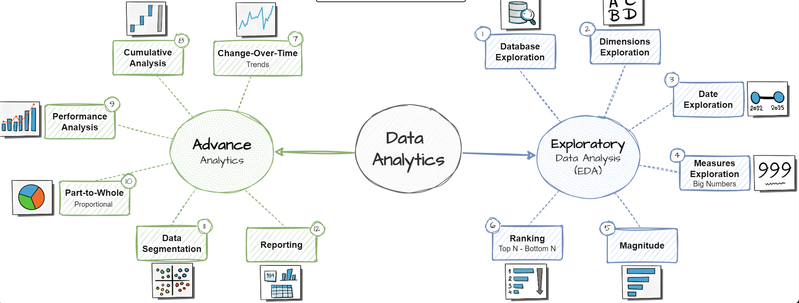

# 📊 SQL Data Analytics Project

A full-stack SQL analytics pipeline simulating a real-world retail scenario. It follows a layered data architecture (Bronze → Silver → Gold) and applies advanced SQL techniques for data cleaning, exploration, segmentation, and final reporting.

---

## 🪙 Layered Dataset Architecture

### 🟫 Bronze Layer (Raw Extracts)
- `bronze.crm_sales_details.csv`  
- `bronze.crm_prd_info.csv`  
- `bronze.crm_cust_info.csv`  
- `bronze.erp_px_cat_g1v2.csv`  
- `bronze.erp_loc_a101.csv`  
- `bronze.erp_cust_az12.csv`

### 🟨 Silver Layer (Cleaned & Structured)
- `silver.crm_sales_details.csv`  
- `silver.crm_prd_info.csv`  
- `silver.crm_cust_info.csv`  
- `silver.erp_px_cat_g1v2.csv`  
- `silver.erp_loc_a101.csv`  
- `silver.erp_cust_az12.csv`

### 🟩 Gold Layer (Analytics-Ready Outputs)
- `gold.fact_sales.csv`  
- `gold.dim_products.csv`  
- `gold.dim_customers.csv`  
- `gold.report_products.csv`  
- `gold.report_customers.csv`

---

## 🧠 SQL Techniques Used

✅ **Joins** (INNER, LEFT, SELF) — for dataset merging across customers, products, and sales  
✅ **Subqueries & CTEs** — to simplify multi-step logic and isolate insights  
✅ **Window Functions** (`RANK()`, `ROW_NUMBER()`, `SUM() OVER`) — for ranking and cumulative trends  
✅ **Date Functions** (`MONTH()`, `YEAR()`, `DATEDIFF()`) — for temporal breakdown and trend analysis  
✅ **Aggregation & GROUP BY** — for metrics like revenue, profit, customer count  
✅ **CASE WHEN** — for segmentation, flagging, and conditional KPIs  
✅ **UNION & EXISTS** — in final reporting and dimensional validations  
✅ **Indexing Strategy (suggested)** — to improve large-scale query performance

These techniques were used to simulate complex business reporting and dashboard-ready outputs.

---

## 📜 SQL Script Breakdown

| Step | Script                                | Description |
|------|----------------------------------------|-------------|
| 00   | `00_init_database.sql`                 | Create tables and schema |
| 01   | `01_database_exploration.sql`          | Explore structure and row counts |
| 02   | `02_dimensions_exploration.sql`        | Analyze product and customer dimensions |
| 03   | `03_date_range_exploration.sql`        | Time-based filtering and seasonal trends |
| 04   | `04_measures_exploration.sql`          | Revenue, quantity, and profit analysis |
| 05   | `05_magnitude_analysis.sql`            | Identify high-volume contributors |
| 06   | `06_ranking_analysis.sql`              | Top/Bottom N by sales and quantity |
| 07   | `07_change_over_time_analysis.sql`     | Monthly/quarterly trend comparisons |
| 08   | `08_cumulative_analysis.sql`           | Cumulative growth using window functions |
| 09   | `09_performance_analysis.sql`          | Benchmark performance against targets |
| 10   | `10_data_segmentation.sql`             | Customer and product segmentation |
| 11   | `11_part_to_whole_analysis.sql`        | Category and region contribution share |
| 12   | `12_report_customers.sql`              | Lifetime value, recency, and frequency |
| 13   | `13_report_products.sql`               | Product-wise performance reports |

---

## 📊 Diagram Overview

1. **Exploratory Analysis**: Schema, dimensions, date filtering, KPIs  
2. **Advanced Analytics**: Cumulative totals, trend tracking, ranking  
3. **Segmentation & Reporting**: Build dimensional views and business reports

---

## ⚙️ How to Run

1. Load the `bronze` or `silver` CSVs into a SQL database (MySQL/PostgreSQL)
2. Run `00_init_database.sql` to create schema and tables
3. Execute scripts `01_...sql` through `13_...sql` sequentially
4. Export the `gold` datasets or use them in Tableau/Power BI dashboards

---

## 🧑‍💻 Author

**Rishabh Parakh**  
[LinkedIn](http://www.linkedin.com/in/rishabh-parakh-4465031a0) • [GitHub](https://github.com/RishabhParakh)

---

## 📄 License

MIT — Free to learn, use, and extend 🎓
